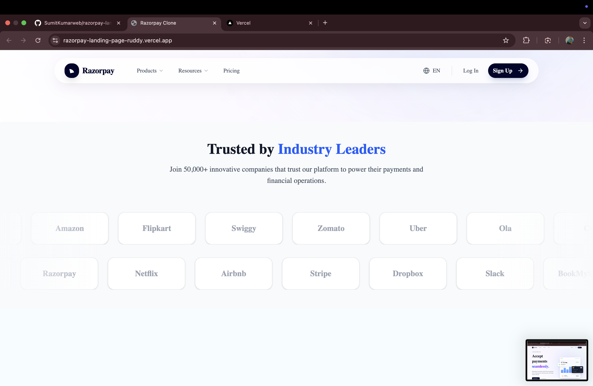
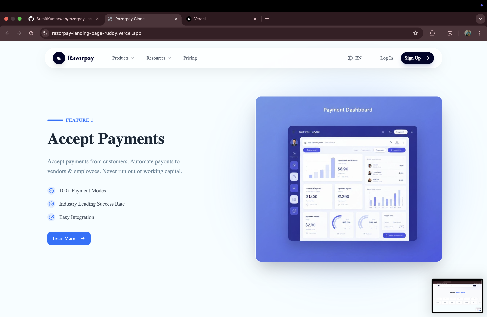
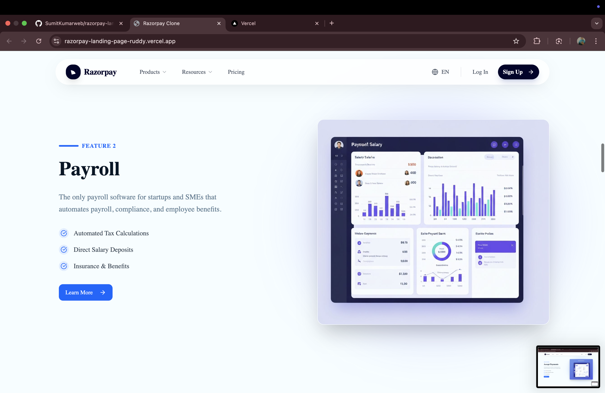
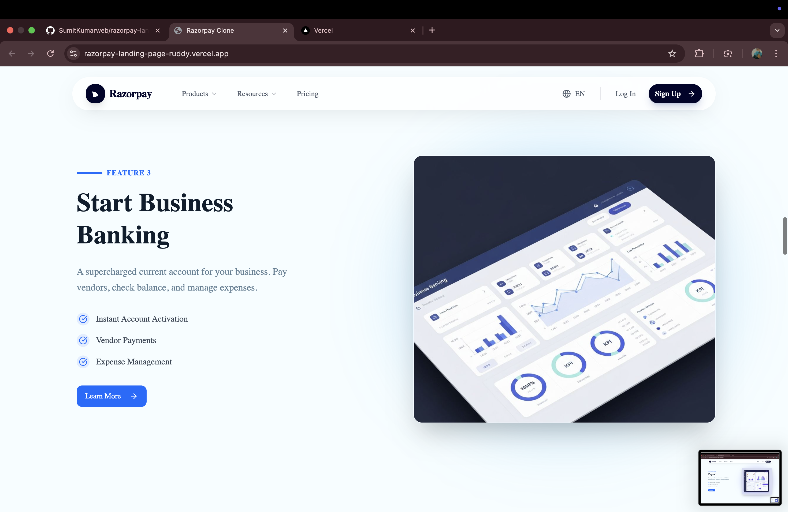
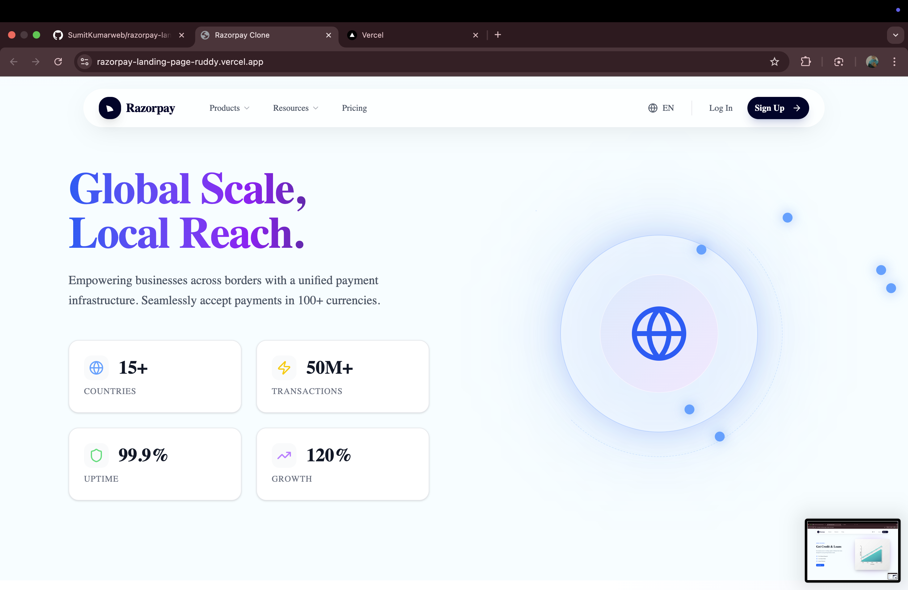
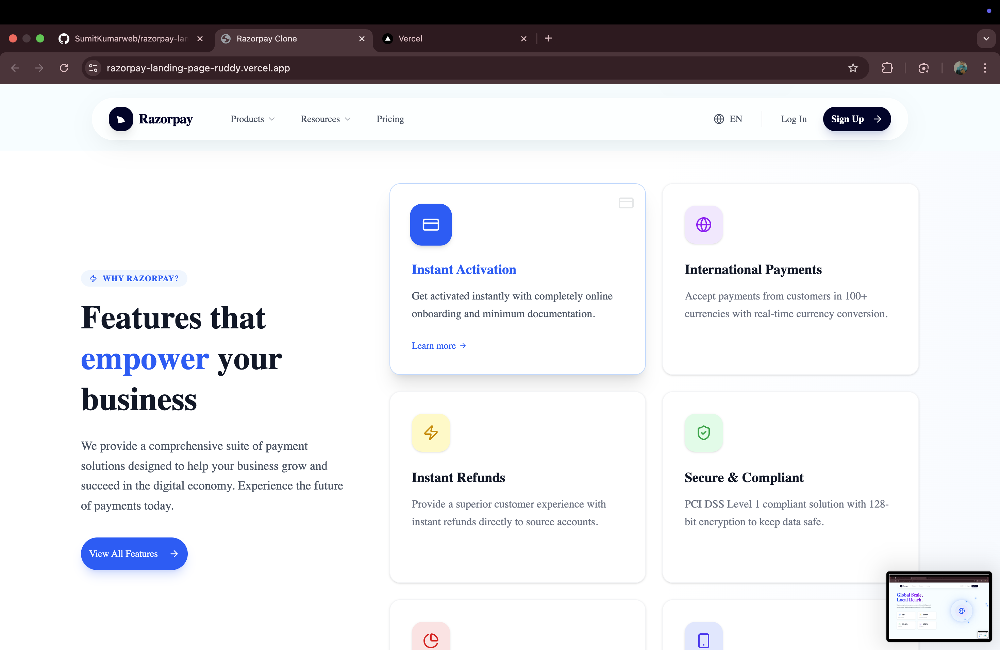
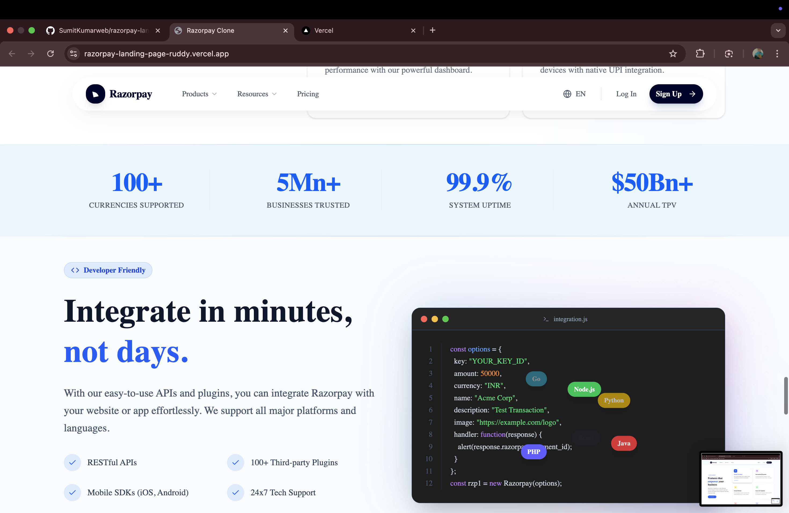
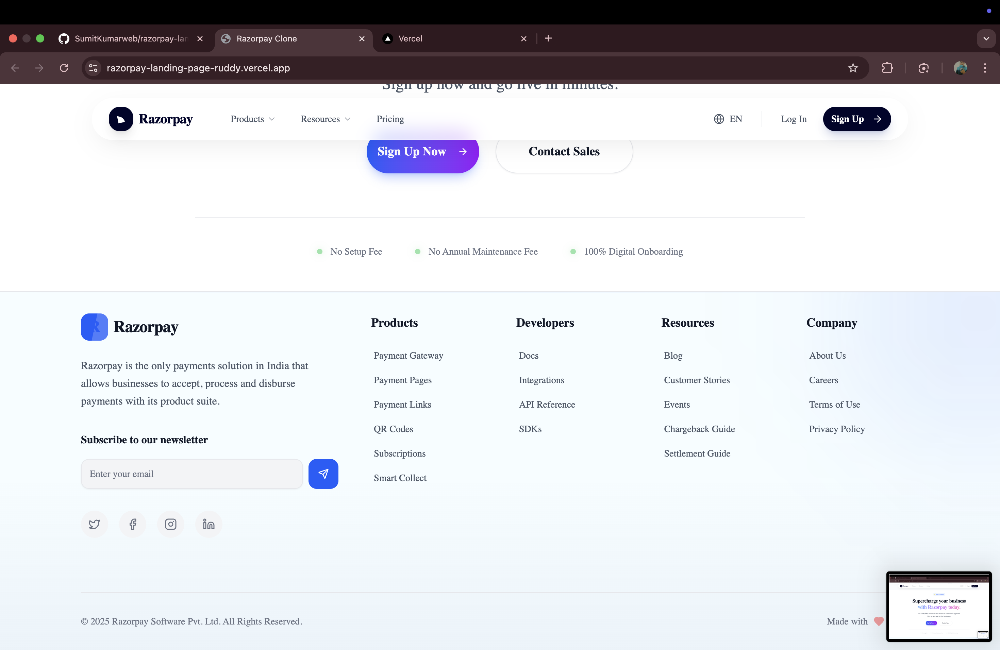

# Razorpay Landing Page Clone

This project is a clone of the Razorpay landing page, built with modern web technologies to replicate the look and feel of the original site with enhanced animations and responsiveness.














## 🚀 Setup Instructions

To get started with this project locally, follow these steps:

1.  **Clone the repository:**
    ```bash
    git clone https://github.com/SumitKumarweb/razorpay-landing-page
    cd razorpay-landing-page
    ```

2.  **Install dependencies:**
    ```bash
    npm install
    ```

3.  **Run the development server:**
    ```bash
    npm run dev
    ```

4.  **Open in your browser:**
    Navigate to `http://localhost:5173` to view the application.

## 🛠️ Frameworks & Libraries Used

This project leverages a powerful stack of modern tools and libraries:

-   **[React](https://react.dev/)**: The core library for building the user interface.
-   **[Vite](https://vitejs.dev/)**: A fast build tool and development server.
-   **[Tailwind CSS](https://tailwindcss.com/)**: A utility-first CSS framework for rapid UI development.
-   **[Framer Motion](https://www.framer.com/motion/)**: For complex and smooth animations.
-   **[Radix UI](https://www.radix-ui.com/)**: Unstyled, accessible components for building high-quality design systems.
-   **[Lucide React](https://lucide.dev/)**: Beautiful and consistent icons.
-   **[React Router DOM](https://reactrouter.com/)**: For client-side routing.
-   **[React Hook Form](https://react-hook-form.com/)**: For efficient form management.
-   **[Zod](https://zod.dev/)**: For TypeScript-first schema declaration and validation.
-   **[clsx](https://github.com/lukeed/clsx) & [tailwind-merge](https://github.com/dcastil/tailwind-merge)**: For conditional class joining and merging Tailwind classes without conflicts.

## ✨ Features

-   **Responsive Design**: Fully responsive layout that works seamlessly on mobile, tablet, and desktop devices.
-   **Modern Animations**: Engaging scroll animations and interactions using Framer Motion.
-   **Interactive Components**: Dynamic UI elements like sticky scroll features, testimonials marquee, and interactive cards.
-   **Clean Codebase**: Organized structure with reusable components and efficient styling.
